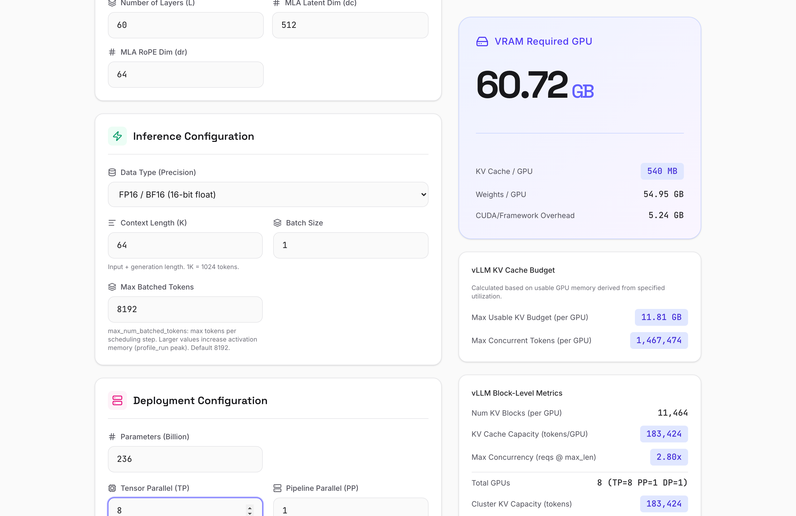

# KV Cache Calculator

[](https://github.com/yang9112/kv-cache-estimator/actions/workflows/main.yml)
[](https://yang9112.github.io/kv-cache-estimator/)
[](LICENSE)
[](https://github.com/yang9112/kv-cache-estimator/releases)

**English | [中文](#中文)**

A lightweight, interactive web tool for estimating GPU memory requirements of KV cache in large language models.



**Live Demo: https://yang9112.github.io/kv-cache-estimator/**

## Features

- **Multi-architecture support** — Standard (GQA/MQA), Multi-Latent Attention (MLA), and Hybrid attention
- **Model presets grouped by family** — DeepSeek, GLM, Qwen, LLaMA, Kimi, MiniMax, and more
- **vLLM KV budget estimation** — calculate max usable KV cache and concurrent tokens per GPU based on VRAM capacity and utilization
- **Custom config import** — drop in a `config.json` from HuggingFace to auto-fill architecture parameters (including MoE fields)
- **Parallelism** — Tensor (TP), Pipeline (PP), Data (DP), and Expert (EP) parallelism with correct MoE weight sharding
- **Precision options** — FP32, FP16/BF16, INT8/FP8, INT4
- **Bilingual UI** — English and Chinese

## Quick Start

```bash
npm install
npm run dev
```

Open http://localhost:3000 in your browser.

## How It Works

The calculator estimates KV cache memory based on attention type:

| Architecture | Formula |
|---|---|
| **Standard** (MHA/GQA/MQA) | `2 x kv_heads x head_dim x precision x layers x seq_len x batch_size` |
| **MLA** (DeepSeek) | `(d_c + d_r) x precision x layers x seq_len x batch_size` |
| **Hybrid** (Qwen 3.5) | Full KV on attention layers only; linear layers use constant memory |

Weight memory is split for MoE models (based on [vLLM source](https://github.com/vllm-project/vllm)):

| Weight Type | Sharding |
|---|---|
| Dense (attention/FFN/embedding) | `/ (TP x PP)` |
| Expert (routed MoE) | `/ (TP x DP x PP)` — DP participates via vLLM `flatten_tp` |
| KV Cache | `/ (TP x PP)` — not affected by DP or EP |

The vLLM budget calculator estimates how many tokens can be served concurrently:

```
Usable VRAM = GPU Memory x Utilization
KV Budget   = Usable VRAM - (Dense Weights + Expert Weights) - Overhead
Max Tokens  = KV Budget / Token Size per GPU
```

## Tech Stack

- React 19 + TypeScript
- Vite 6
- Tailwind CSS 4
- Lucide Icons
- Framer Motion

## Contributing

Contributions are welcome! Please feel free to open issues or submit pull requests.

## License

[MIT](LICENSE)

---

## 中文

一个轻量级的交互式 Web 工具，用于估算大语言模型推理时 KV Cache 的显存占用。

**在线体验: https://yang9112.github.io/kv-cache-estimator/**

### 功能特性

- **多架构支持** — 标准注意力 (GQA/MQA)、多潜空间注意力 (MLA)、混合架构 (Hybrid)
- **模型预设按系列分组** — DeepSeek、GLM、Qwen、LLaMA、Kimi、MiniMax 等
- **vLLM KV 预算估算** — 根据单卡显存容量和占用率，计算可用 KV Cache 上限和最大并发 Token 数
- **导入 config.json** — 从 HuggingFace 拖入模型配置文件，自动填充架构参数（含 MoE 字段）
- **并行策略** — 张量并行 (TP)、流水线并行 (PP)、数据并行 (DP)、专家并行 (EP)，MoE 权重按 vLLM 源码正确切分
- **精度选项** — FP32、FP16/BF16、INT8/FP8、INT4
- **中英双语** — 界面支持中文和英文

### 快速开始

```bash
npm install
npm run dev
```

打开 http://localhost:3000 即可使用。

### 计算原理

根据注意力类型估算 KV Cache 显存：

| 架构 | 公式 |
|---|---|
| **标准** (MHA/GQA/MQA) | `2 x KV头数 x 头维度 x 精度字节数 x 层数 x 序列长度 x 批次大小` |
| **MLA** (DeepSeek) | `(dc + dr) x 精度字节数 x 层数 x 序列长度 x 批次大小` |
| **混合** (Qwen 3.5) | 仅全注意力层使用完整 KV Cache；线性注意力层为常数内存 |

MoE 模型的权重需拆分计算（基于 [vLLM 源码](https://github.com/vllm-project/vllm)）：

| 权重类型 | 切分方式 |
|---|---|
| Dense (attention/FFN/embedding) | `/ (TP x PP)` |
| Expert (路由 MoE) | `/ (TP x DP x PP)` — DP 参与切分（vLLM `flatten_tp`） |
| KV Cache | `/ (TP x PP)` — 不受 DP 或 EP 影响 |

vLLM 预算计算器额外估算可服务的最大并发 Token 数：

```
可用显存 = 单卡显存 x 占用率
KV 预算 = 可用显存 - (Dense 权重 + Expert 权重) - 框架开销
最大 Token = KV 预算 / 单 Token 显存占用
```

### 技术栈

React 19 + TypeScript / Vite 6 / Tailwind CSS 4 / Lucide Icons / Framer Motion

### 开源协议

[MIT](LICENSE)
